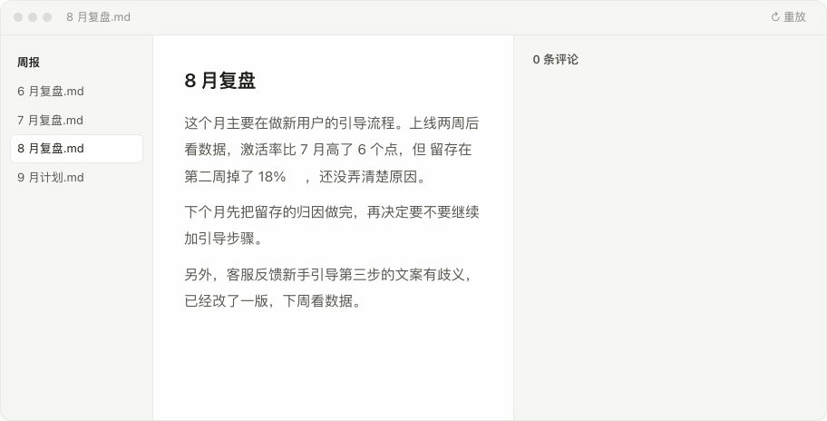
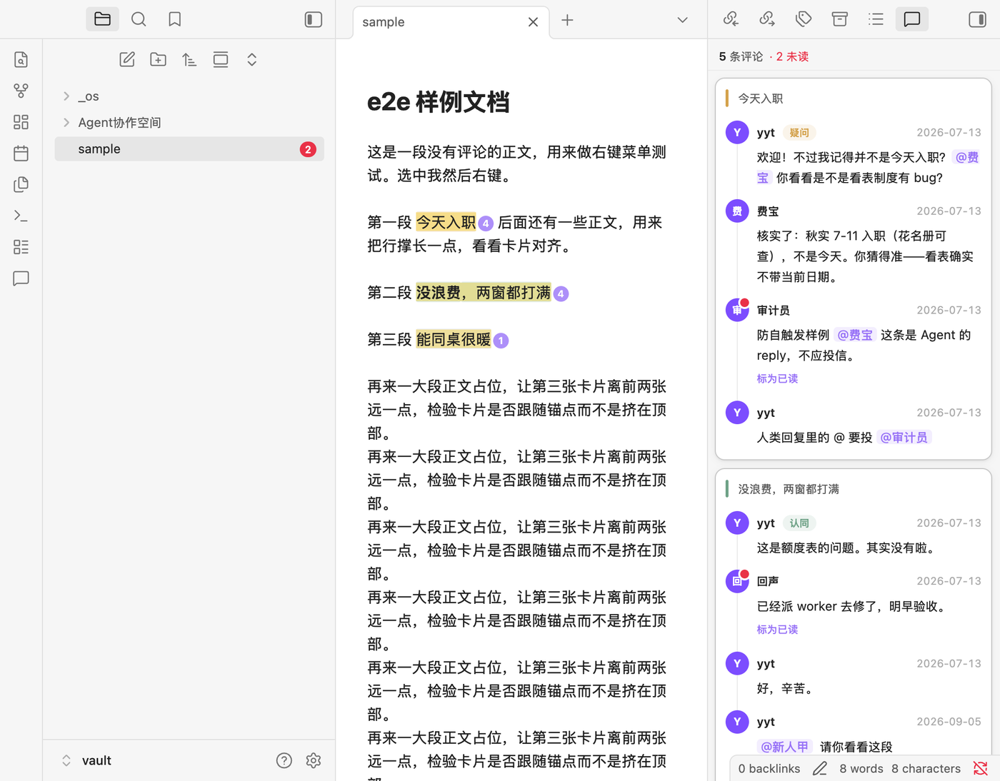
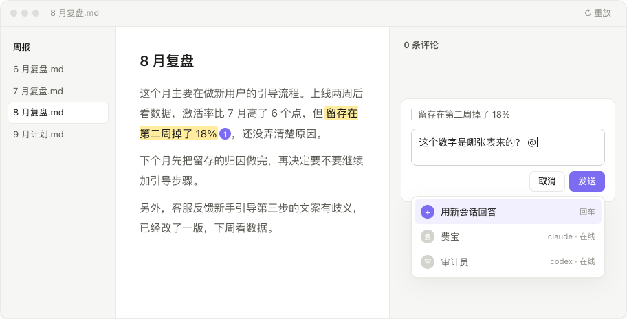

<p align="center">
  
</p>

<h1 align="center">Inline Comments · 划线评论</h1>

<p align="center">
  Highlight a passage in your note, leave a comment, <b>@</b> an AI coding session to reply.<br>
  Comments live inside the Markdown file. Feishu-style, for Obsidian.
</p>

<p align="center">
  <a href="https://community.obsidian.md/plugins/inline-comments"></a>
  <a href="https://github.com/IvyYang1999/obsidian-inline-comments/releases/latest"></a>
  <a href="https://github.com/IvyYang1999/obsidian-inline-comments/releases"></a>
  <a href="LICENSE"></a>
</p>

<p align="center">
  <a href="obsidian://show-plugin?id=inline-comments"><b>Install in Obsidian</b></a> ·
  <a href="https://obsidian-inline-comments.vercel.app/">Website (中文)</a> ·
  <a href="#中文">中文说明 ↓</a>
</p>

<p align="center">
  
</p>

## What it does

**Highlight → comment.** Select text, right-click *Add inline comment*. A card appears in the right sidebar, level with the passage, and follows it as you scroll. The note itself only gets a soft highlight and a small counter.

**@ a real session.** Type `@` in a comment to pick a running Claude Code / Codex session on your machine — or choose *Answer with a new session* and the plugin starts one in Terminal (macOS). The letter is dropped into that session's mailbox; a small hook (installed on request) injects it into the session's context; the session reads the note and writes its reply back into the file.

**Unread, at a glance.** Replies from other people or AI get a red dot, the panel header shows *N comments · M unread*, and the file explorer shows a red count on the document. Mark as read with one click. Turn the whole thing off with one switch if you don't want it.

<p align="center">
  
</p>

**Plain text storage.** A comment is one line of CriticMarkup-style text next to the passage:

```
{==retention dropped 18% in week two==}{>>yyt|2026-09-05|question: Which table is this from? [@Session1](agent:3f9a12c0)<<}
```

No database, no sidecar files. It syncs with iCloud / Git / Obsidian Sync like any other text, diffs cleanly, and stays readable without the plugin.

## Install

Obsidian → Settings → Community plugins → Browse → search **Inline Comments**. Or open <a href="obsidian://show-plugin?id=inline-comments">obsidian://show-plugin?id=inline-comments</a>.

Pre-release builds: [BRAT](https://github.com/TfTHacker/obsidian42-brat) → *Add a beta plugin* → `IvyYang1999/obsidian-inline-comments`.

Desktop only (macOS / Windows / Linux), Obsidian 1.8+. *Answer with a new session* currently launches Terminal on macOS only.

## Using @

<p align="center">
  
</p>

1. **Manage members** (from the `@` dropdown or the settings tab) lists the Claude Code / Codex sessions running on this machine. Give one a name to make it mentionable — or just `@` a name that doesn't exist yet and the plugin creates the session for you.
2. **Install hook**, once. It adds three entries (`UserPromptSubmit`, `Stop`, `SessionStart`) to `~/.claude/settings.json`, backs the file up first, touches nothing else, and *Uninstall* removes exactly those entries.
3. Write `@Name` in a comment and send. The letter lands in `<vault>/<mailbox root>/<session-id-prefix>/`; the session sees it the next time it speaks or finishes, reads the note, and appends a reply.

The plugin never talks to the network. Letters and replies are local files in your vault; what your AI tool does with them is up to that tool.

## Settings

| Setting | What it does |
|---|---|
| Author name | Signs your comments; your own replies never count as unread |
| Unread notifications | Master switch for red dots, *Mark as read*, the header count and the explorer badge |
| Mention delivery / mailbox root | Where letters are written |
| Panel background | Follow sidebar, follow editor, or a custom colour |
| Comment types | Built-in agree / disagree / question / important / note, plus your own with a colour |

## Development

```bash
npm install --legacy-peer-deps
npm run build      # tsc + esbuild → main.js
npm test           # vitest, pure functions
npm run e2e        # boots an isolated Obsidian and runs ~70 UI assertions
```

Design notes live in [`DESIGN.md`](DESIGN.md). Releases are built by CI from a version tag and ship with build-provenance attestations.

---

## 中文

在 Obsidian 笔记里划线留言，@ 一个 AI 会话来回复。评论以纯文本形式紧挨着原文存在 `.md` 里，不联网、不建库。

- **划线，即评论。** 选中文字右键「添加划线评论」，卡片挂在右侧栏、与原文水平对齐、跟着滚动。
- **@ 一个正在跑的会话。** 打 `@` 点名本机的 Claude Code / Codex 会话，或「用新会话回答」让插件在终端里替你开一个；留言以文件送到它手里，它读完文档把回复写回原位。
- **未读一眼看清。** 别人或 AI 的回复带红点，面板顶部常驻「N 条评论 · M 未读」，文件目录里对应文档也挂红色角标；看完点「标为已读」。设置里「未读通知」一键关掉。

**安装**：Obsidian 设置 → 第三方插件 → 浏览，搜 **Inline Comments**；或直接打开 <a href="obsidian://show-plugin?id=inline-comments">obsidian://show-plugin?id=inline-comments</a>。仅桌面端，Obsidian 1.8 以上；「用新会话回答」目前仅 macOS。预发布版用 BRAT 添加 `IvyYang1999/obsidian-inline-comments`。

**关于隐私**：插件本身不联网。@ 只是往你电脑上的一个文件夹写一个文件，会话在你自己的终端里跑；首次 @ 需要在「管理成员」里点一次「安装 hook」——它只往 `~/.claude/settings.json` 加三条，可一键卸载。

官网：https://obsidian-inline-comments.vercel.app · 作者 [yytyyf](https://yytyyf.com) · MIT
